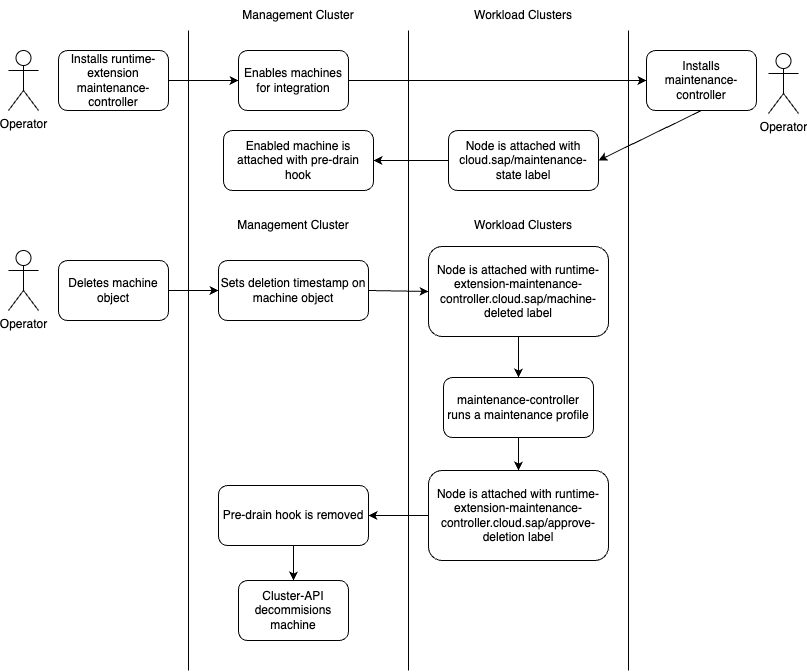

# runtime-extension-maintenance-controller

A controller that connects the [maintenance-controller](https://github.com/sapcc/maintenance-controller) with [Cluster API](https://github.com/kubernetes-sigs/cluster-api).

## Motivation
Cluster API provides a way to declare, create, and manage Kubernetes clusters.
By integrating with the maintenance-controller, the automation can be extended to the maintenance processes, providing a more comprehensive cluster lifecycle management experience.
The maintenance-controller enables easy and structured maintenance processes for the nodes in a Kubernetes cluster.
When integrated with the Cluster API, the maintenance of `Machine` objects can be orchestrated and aligned with deployments in workload clusters.

## Concept
A `Machine` object that should adhere to a maintenance-controller deployment in the workload cluster needs to be attached with the `runtime-extension-maintenance-controller.cloud.sap/enabled: "true"` label.
This is done best on `MachineDeployment` resources for consistency reasons.
As soon as a machine is marked as enabled for runtime-extension-maintenance-controller it is annotated with `pre-drain.delete.hook.machine.cluster.x-k8s.io/maintenance-controller: runtime-extensions-maintenance-controller` to stop the cleanup logic of Cluster API on machine deletion.

Instead the corresponding `Node` object in the workload cluster is marked with the `runtime-extension-maintenance-controller.cloud.sap/machine-deleted: "true"` label.
This label should be used to trigger the maintenance-controller in the workload cluster.
The `runtime-extension-maintenance-controller.cloud.sap/approve-deletion: "true"` label shoud be used by the maintenance-controller to notify the runtime-extension, that the node is ready to be removed.
After attaching the approve-deletion label the pre-drain hook will be removed, which allows machine deletion to continue.

## Installation
A Helm chart is available [here](https://github.com/sapcc/helm-charts/tree/master/system/runtime-extension-maintenance-controller).
